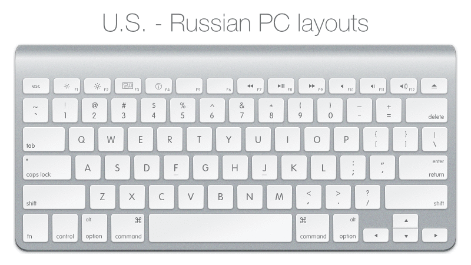

Caps Switcher
----------------------------------------------
Have you ever used the Caps Lock button on your keyboard? Probably not. You can finally make CapsLock useful. Switch your keyboard layouts by it.

###What is that?
This is a keyboard layout which allows you to switch the input source language in OS X using Caps Lock key.

The main idea is that:
- 99.99% of people don't use the Caps Lock button.
- It's very useful to use Caps Lock as a language switcher
- You can recognize your current input source glancing at the CapsLock LED indicator on your keyboard


###List of layouts (add screenshots):
- U.S. - Russian PC

- U.S. - German
TODO: add image

###How to install.
Copy the layout file to the /Library/KeyboardLayouts folder and select it in the Keyboard Preferences.

###Download links
- [U.S. - Russian PC] (https://github.com/DanPristupov/CapsSwitcher/raw/master/src/Caps%20Switcher%20US%20-%20RU%20PC.keylayout)
- [U.S. - German] (https://github.com/DanPristupov/CapsSwitcher/raw/master/src/Caps%20Switcher%20US%20-%20DE.keylayout)

###How to contribute
- There's a bug! -> Create an issue.
- I want to add my language/layout! -> Great! You can use Ukelele to edit OS X keyboard layouts.

### POI
- Translate this document to the target languages.
- Create a similar layout for Windows.